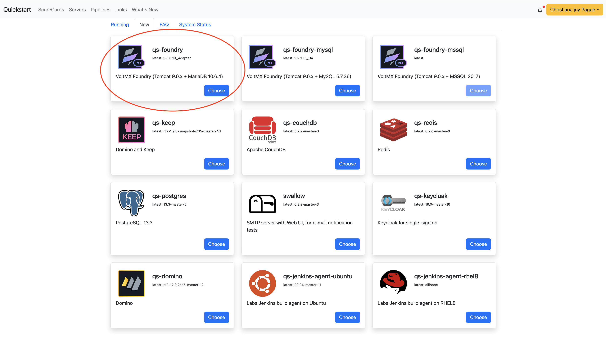

# Foundry
_________

## How to create a foundry server instance

1. Login to Quickstart
    - Click **Login with Github**
    <br>
        ```
        https://www.qs.hcllabs.net/login
        ```
    <br>
    

2. You will see all the running servers
    

3. To create a new server, select **New** then choose the server instance you wish to create.
    
    
    - For this example, I will select qs-foundry server
    
    
    - Fill out the necessary fields:
        - Server Name
        - Latest Application Version
        - Custom Value to default value
    
    - Next screen will show you this:
    
    - You may go back to the **Running** tab to see the status of your new qs foundry instance
        - select the blue arrow icon to start up the application
        

## Existing Foundry Server

1. If you are to access an existing server, click the blue arrow icon to start up the foundry console
    

2. You are to provide your credentials to be able to login.
    
    - Example:
        
    - Foundry Console Dashboard
        

    - Make sure you have an access to the foundry console. See example of list of users below
    

    - If you are not an existing user, contact your admin/team lead to give you access to the foundry console.