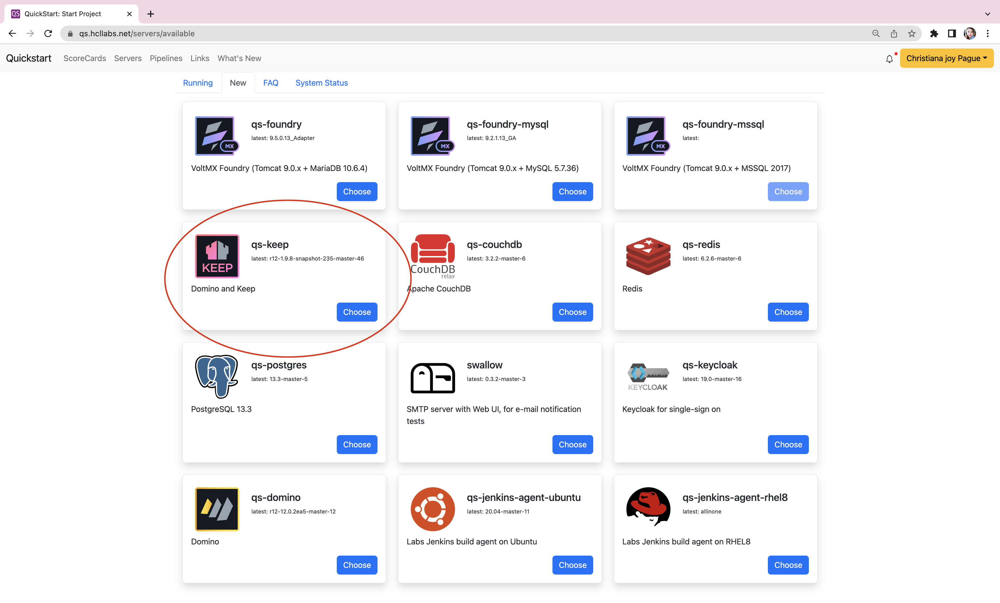
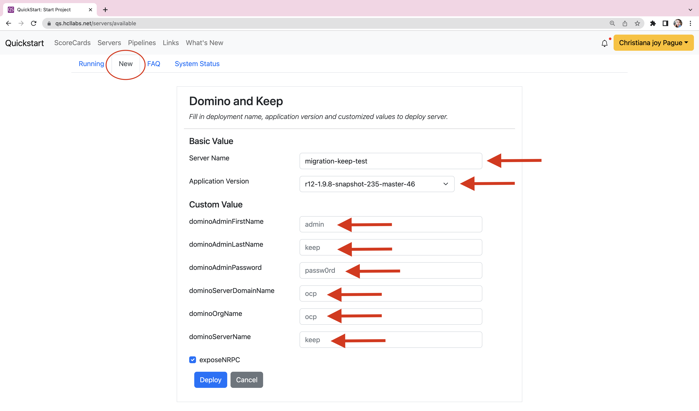
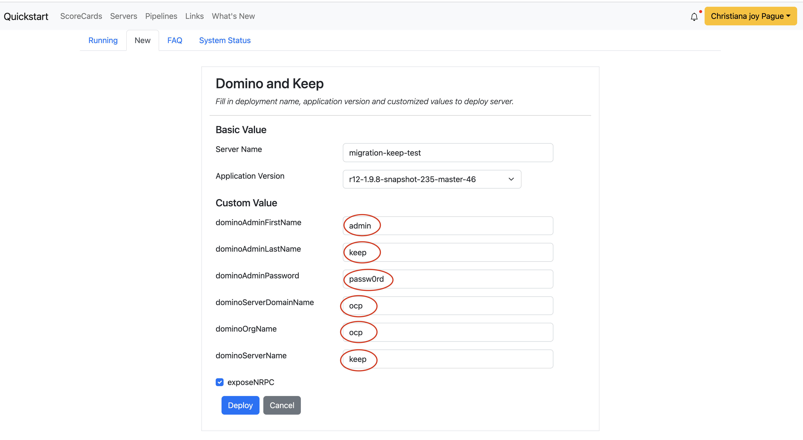
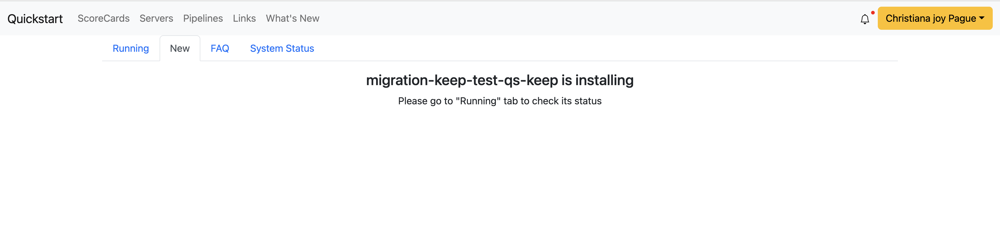
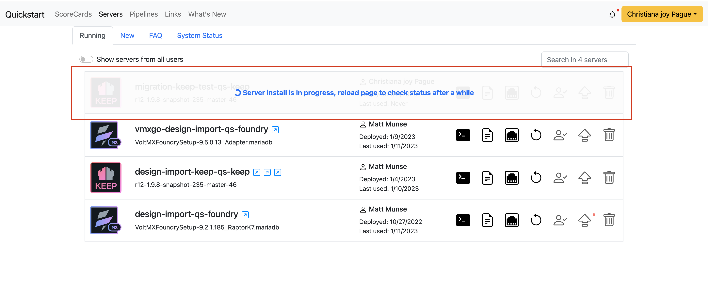

# KEEP

## How to create a keep server instance

1. Login to Quickstart
    - Click **Login with Github**
    <br>
        ```
        https://www.qs.hcllabs.net/login
        ```
    <br>
    

2. You will see all the running servers
    

3. To create a new server, select **New** then choose the server instance you wish to create.
    
    
    - For this example, I will select qs-keep server
    
    
    - Fill out the necessary fields:
        - Server Name
        - Latest Application Version
        - Domino Admin First Name
        - Domino Admin Last Name
        - Domino Admin Password
        - Domino Admin Server Domain Name
        - Domino Org Name
        - Domino Server Name
    
    - It is adviced to use the same value of the placeholder value showing in the fields
    
    - Next screen will show you this
    
    - You may go back to the **Running** tab to see the status of your new qs foundry instance
    
    - Once done, select the blue arrow icon to start up the application
