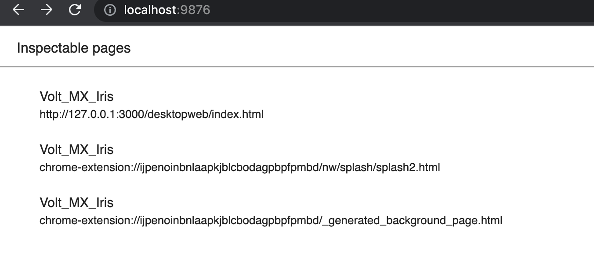
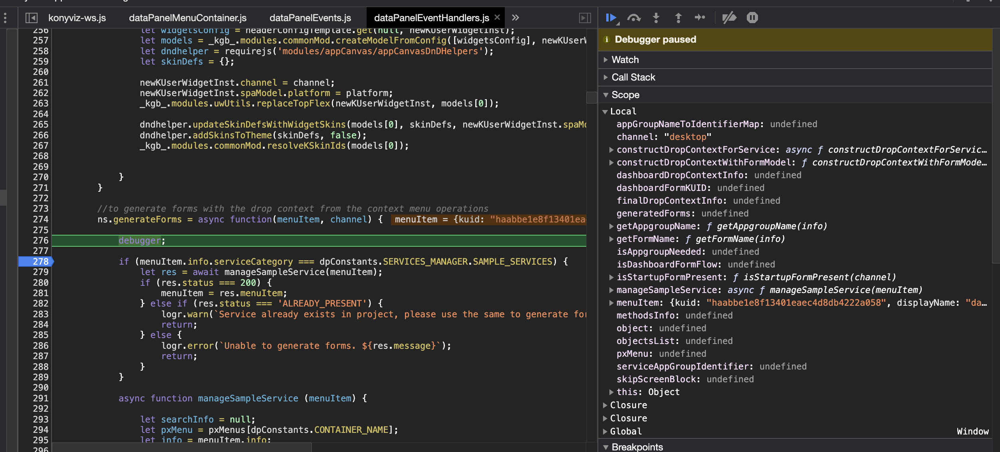

# Debuger
_____________
#### Remove --disable-devtools
<br>

1. On the root folder of 'konywebstudio,' open the file named 'package.json' 
    <br>
   (**Note**: Revert this change before committing, or don't include this file on the commit)
    - Go to line no. 9, where the key name is "chromium-args"
    - Remove the snippet '--disable=devtools' from the value
    

2. Open the file named **run_mac.sh** (for Mac) or **run_win.bat** (for Windows) 
    - Add the following snippet of code in between "…Iris" and the dot (.)
    <br>
    ```
    --remote-debugging-port=9876
    ```
    

3. Once you're done, run iris via the command 
    <br>
    For Mac
    <br>
    ```
    ./run_mac.sh
    ```
    <br>

    <br>
    For Windows
    <br>
    ```
    run_win.bat
    ```

4. Go to a browser, and type in **localhost:9876**
    - The links above serves different purpose:
		1. The first one is for the frontend side of the application. <u>You will work on mostly in this page</u>.
		2. Second is just for the splash screen. The least important and rarely use.
		3. Third is for backend request. This is mostly related to the lib folder of konywebstudio.
    <br>
    

5. Click item that you want to debug and it looks like this. You can add now a breakpoint.
    - This is what it should look like in the browser. You can now add **debug** anywhere in konywebstudio code as a breakpoint.
     

# Debugging
_________________
## How to add breakpoints?

1. public/desktopweb folder holds the frontend codes of iris and the codes here can be observed using a debugger. Either by:
    - Adding a debugger inline within the code (this is not highly recommended and make sure that before you push it to the repository, you have remove this already)
    <br>
    
    - Adding a breakpoint in the source panel of the web inspector. 
    <br>
    

2. It is highly recommended to use the <b>source</b> panel of your browser to make the breakpoints only for your use and will not affect the codes in general.
    - click the first link of the inspectable pages
    <br>
    
    - Click on source tab
    <br>
    
    - Look at the files that you want to debug (folder structure of public/desktopweb)
    <br>
    
    - Click on the line that you will observe by clicking the line code number, example line 529
    <br>
    
    - And trigger it using the IRIS app. Make sure that the localhost:9876 is enabled in the browser before you make the action in the app.
    - You will notice that the IRIS application will stop if its already hit the line that you are trying to break
    <br>
    
    
    - You can make use of the icons on the right side of the source panel to resume, step over, step into the codes
    <br>
    
    - If you are going to restart the application, make you that you will restart also the web inspector browser since it will be disabled once you stop running the application.
    <br>
    

## How to copy variables in breakpoints

For example you are now observing the using the breakpoints and debugger and you wanted to have a copy of the variables being passed into each function, you can:

1. Look for the variable that you want on the right side of the source panel. For example we have menuItem variable. (as long as the variable has been called already, then you can see it under the "local" section
    <br>
    
2. Right click on the variable and select "store as global variable"
    <br>
    
3. You will notice on the bottom part of the source panel, there is a console that shows some details about the variable and also a variable name (temp1) . Temp1 is the name of the temporary variable where the menuItem is being stored.
    <br>
    
4. To copy this on your clipboard, type on the console "copy(temp1)"  and hit enter.
    <br>
    
5. Even though it says undefined, the value is still save on your clipboard so make sure to paste it somewhere before you copy new values
    <br>
    
6. You can store as many temp variable as you can, but make sure to change the variable name on the "copy" command. 
7. There are some variables that cant be properly copied like the example below since this one is a Class. So you need to dig into the class variable and look for the specific object that you want to observer within that.
    <br>
    