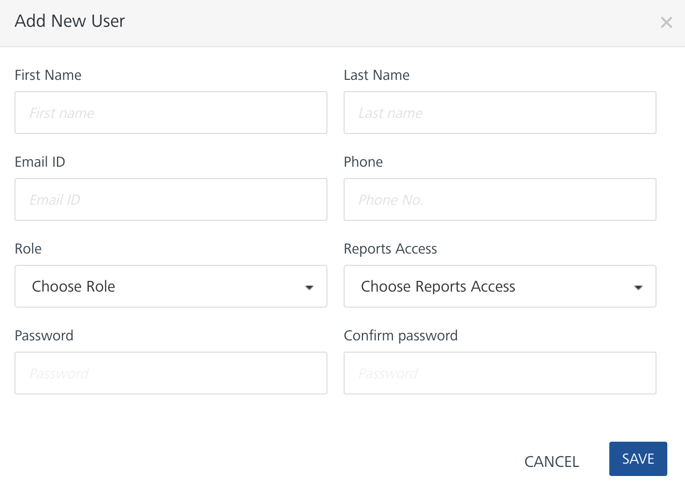
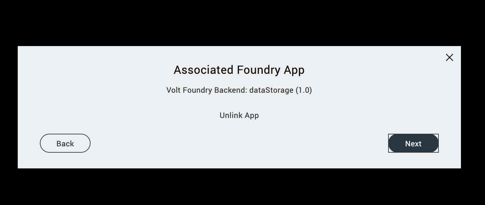

# Design Import
____________________
## How to connect Iris to Foundry server:

1. Go to the menu bar, go to Volt MX Iris > Preferences:
    - Mac
     
    

    - Windows
     
    

2. On the Volt MX Foundry tab, type in the Foundry URL: <b>https://vmxgo-design-import-qs-foundry.qs.hcllabs.net</b> and click <em>Validate</em> then <em>Done</em>
     
    

3. Make sure to have an account on the foundry qs server. Your name should be listed in the users' list. 
     
    
     
    - If you don't have it, ask the admin to create one for you
    

4. On the top right corner of Iris, click Login. And type in you credentials. (Example, Email: timothykenneth.arcet@hcl.com, Password: Pass123$)
     
    
     
    

5. You can now try the Migration tool on Iris. Go to <b>Project</b> > <b>Import</b> > <b>Domino Applications</b>
     
    

6. On the Keep Identity service, a prompt will appear. Type in the credentials, <b>Username</b>: admin keep, <b>Password</b>: passw0rd
     
    

# Design Import Wizard
______________
## Code Structure

Wizard folder are composed of different files like:

1. public/desktopweb/app/wizard/domino/index.js
    - This is where you need to declare the screens that you are going to import within the wizard. 
2. public/desktopweb/app/wizard/domino/utils.js
    - You don’t need to modify this unless you want to add new features to wizard that will affect / will be used across all screens.
3. public/desktopweb/app/wizard/domino/constants.js
    - This is for any constants variables that will be used across all screen. The most important line here is the STEPS object (should be the last part) since if you need to add new screen, then you need to add a new value here.
     
    
4. public/desktopweb/app/wizard/domino/< screen-name >/viewConfig.js
    - This is the declaration of the screen including its properties, modules and components. You will need to import these in index.js if you are going to declare this as part of the wizard flow.

## Sample create new screen

To create a new screen, the instructions are below:

1. Create a folder for that new screen.
(You will notice that for each screen there is a specific folder created.)
    - a. Name the folder based on the functionality of the screen (camelCase). And then create viewConfig.js inside of it
         
        
2. Contents of viewConfig.js
    - a. You can copy the contents of viewConfig.js on any file or you can use the template below. Just change all the text that has ***CHANGETHIS*** based on the proper values
     
    [viewConfig.js-Template](`https://hclo365-my.sharepoint.com/personal/gladys_obmerga_hcl_com/_layouts/15/onedrive.aspx?id=%2Fpersonal%2Fgladys%5Fobmerga%5Fhcl%5Fcom%2FDocuments%2FOneNote%20Uploads%2FviewConfig%2DTemplate%2Ejs&parent=%2Fpersonal%2Fgladys%5Fobmerga%5Fhcl%5Fcom%2FDocuments%2FOneNote%20Uploads&ga=1`)
    - b. Make sure to change the following
        - Script guard details - it should be the path of the screen
         
        
        - Example:
         
        
    - c. Defining and using modules
        - If there are other modules that you need to use in the screen, then you need to import it in this line of code. But the default one is always the constants and then the utils
         
        
        - Example of adding modules
          
        
        (Here you are adding the 4 different modules inside the screen (see public/desktopweb/app/wizard/domino/gettingStarted/viewConfig.js as an example)
         
         
        <mark>Take note that the arrangement of the declaration matters since that’s how konywebstudio import external modules. For example, modules/mf/mfUtils is the third one under the define array, it should be third parameter on the function parameters as well. The arrangement tells which one to reference to. </mark>
         
         
        - Then the variable within the function parameter will be the string to use within the screen. For example
        

    - d. Get function
        - This is the only function that will be return and exposed outside the screen. 
         
        
        (The return value of this function will define the structure and contents of the screen.)
    - e. Rows content
        - e.1. This is usually the contents of the return value of get function. View, id and classList are already default and you should avoid modifying these.
        - e.2. The contents of the screen is define by row. For example the first item on the row array is the close button. Then the first line that will be shown on the screen is the close button.
             
            
            
        - e.3. Next item in the array is the new line of the row which is the Getting started title. 
            
            
        - e.4. There is a certain format when declaring components within the screen. Please refer to some examples on other screens on how to add title, label, input field, buttons etc. For the example above, we have that format for adding a step title label
        - e.5. All component that can be add with the wizard screen can be check in this folder: public/desktopweb/app/ui/views
        - e.6. The last item on the rows arrays should be the footer buttons, which is ideally the next, back or submit button
            
            
                - f.1. This is usually fetchin the pcUtils.getFooterConfig function and we just need to declare what are the buttons on the right or left side of the footer. For example: 
                 
                
        - e.7. wizard.navigateTo(* * step Screen * * ) this is where you need to declare which screen should be showns based on the added button.

3. Declare the new screen in constants.js
    - a. After you have setup the new screen, go to public/desktopweb/app/wizard/domino/constants.js
    - b. Add a new item to STEPS object using the SNAKE_CASE format and the folder name (camelCase)
         
        
    - c. The arrangement is based on the steps of the wizard flow. For example we want to add the new screen after the getting started, then we will add the new item after the GETTING_STARTED item.
4. Declare the new screen in index.js
    - a. To formally add the new screen within the wizard flow, go to public/desktopweb/app/wizard/domino/index.js
    - b. Declare the new screen in the define section of the index.js . Take note of the arrangement of the declaration. If you add it as the fourth item, then the new function parameter should be on the fourth item
         
        
    - c. Under the steps config, add a new array for the new screen. Since in our example we will add it after the Getting started screen, then we should add a new array after the Getting started array
         
        
        
        <mark>(Take note of the STEPS.ADD_NEW_SCREEN and the value of the getViewConfig. These are the values that we set on the constants.js and the define function)</mark>
         
         
    - d. Even though we already declare the new screen in index.js, we still need to included this in one of the screens of the wizard. For example, we are assuming that after clicking the get started button in GETTING_STARTED screen, we will be redirected to the new screen
    - e. We need to change the wizard.navigateTo of the getting started screen to redirect us to the ADD_NEW_SCREEN
         
        
    - f. For every changes that we did on the code, we need to restart the IRIS app.

## Current Flow
SUBJECT TO CHANGE BASED ON REQUIREMENTS 

1. Getting Started
    - Some description on what to expect on the wizard, parameters that are needed initially 
2. Associate Foundry App 
    - Before we can make use of the app, we need to make sure that there is already a foundry app linked to the current iris project. We can create a new one or use an existing one 
    - Unlink app is not working yet. 
         
        
        
        
3. Create Keep Services
    - This is where we initialize the keep services in the foundry
    - Only the Create New option is working. The select option is for development
    - For the Create New, it will ask all the necessary details in creating keep services
         
        
    - After adding all the details, a new set of keep integration services will be created in foundry
        
        
        
        
        
    - The details of these needs to be updated.
4. Connect to Keep Identity service
    - You will be ask to login to keep identity service
        
        
5. NSF Selection
    - You will choose which nsf file to migrate.
    - This will be improve later on 
    
6. Data Analysis
    - This is where the pitcairn application will start.
    - Ideally we will scan first the application and analyze the contents.
    
7. Migration Option
    - We have different routes to take but this is still subject to change. Always choose the first option
    
8. Generate Forms
    - After analyzing and determining the contents to be migrated, generating forms will be the next one
    
9. Generate Foundry Services
    - If there are still foundry services that needs to be migrated, we will add this in this part of the screen
    - No functionality has been added yet on this part
10. Connect to Foundry
    - If there are mappings yet to be added
    
11. Result
    - Show if the migration is success or not
    

# Adding Modules
_____________
Modules are essential piece of the konywebstudio, you can mostly see the codes within kony as reusable set of codes that can be imported almost anywhere in the codes (but with certain format and exception of course)

You will see all the modules, especially for the frontend side of IRIS in : public/desktopweb/app/modules

If there are functions that are not available in konywebstudio, we need to create a module for that and we can create it under: public/desktopweb/app/modules/migration

**IMPORTANT: AVOID MODIFYING ANY MODULES THAT ARE NOT RELATED TO DESIGN IMPORT. PLEASE CONSULT IF YOU NEED TO MODIFY ONE**

1. Creating new module
    - The usual format of a new module file is the following:
        - Script guard
        - Define function
        - Return value
        
2. Creating functions within module
    - You can create it in two ways
        - Using normal function return
        
        - Using ns function (widely used in kony)
        
        (This utilizes ns parameter and strictly follow the format above.)
3. This utilizes ns parameter and strictly follow the format above.
Importing module into another module
    - In order to define or reuse the module, you can declare it in define function method as mentioned in other section. 
    - Just take note that the path that you will add in the define method will depend on where the file is located

