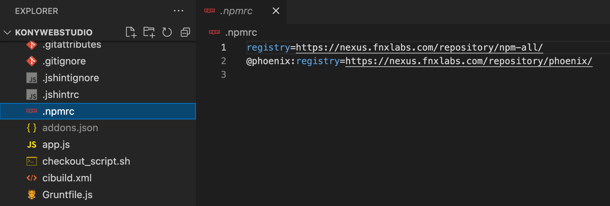
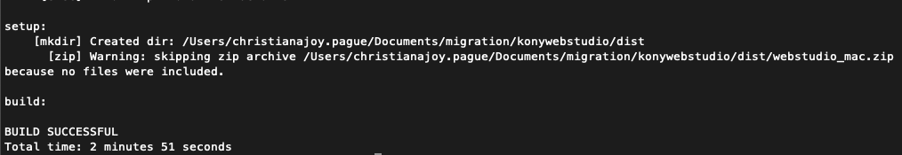
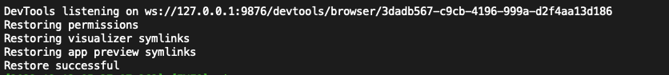
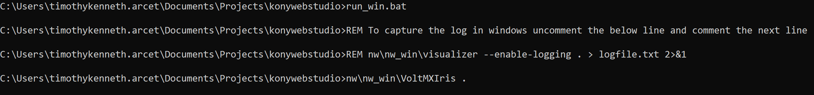
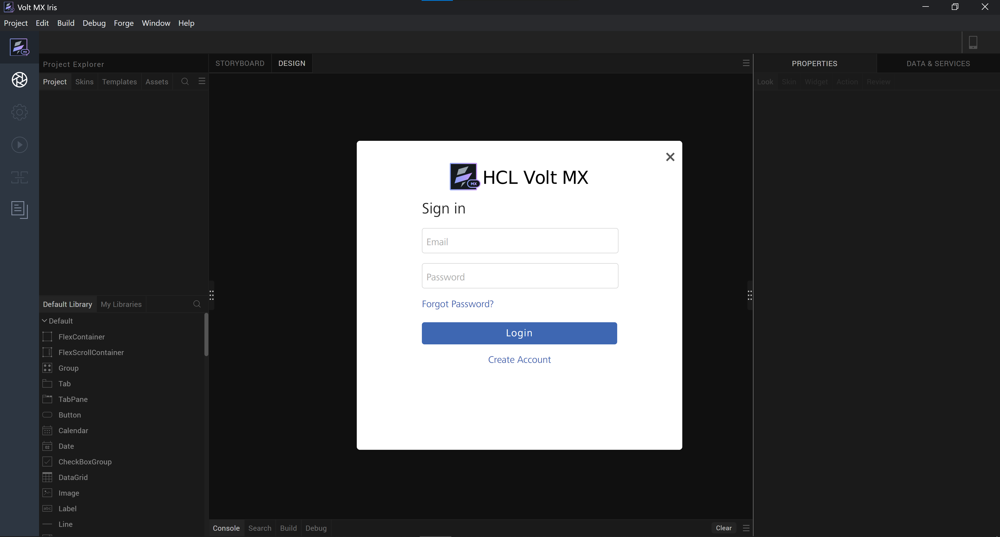
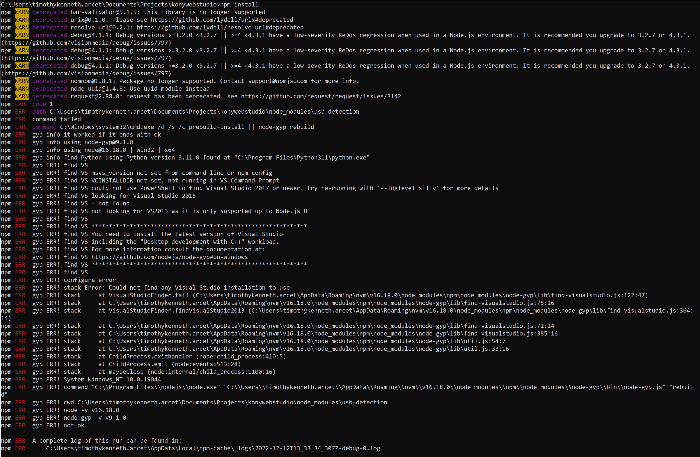
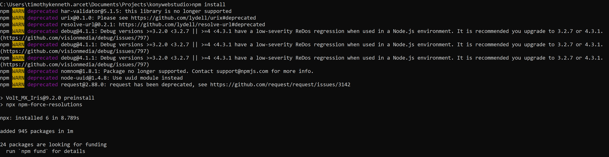

# Installation
______________

## VPN
1. Make sure you are connected to a VPN (GlobalProtect/SafeLinx) throughout the process.
    - if no VPN access yet, refer to this [**guideline**](https://teams.microsoft.com/l/channel/19%3A644478a2890541ed800171a26671f201%40thread.tacv2/tab%3A%3A668f359a-8f50-408b-91a0-f9822d996c85?groupId=88fe1523-7bc2-4e36-8be6-f0ee46ad171c&tenantId=189de737-c93a-4f5a-8b68-6f4ca9941912&allowXTenantAccess=false) to request for vpn access.
    

## SSH KEY
2. Setup github ssh-key
    - If no ssh key associated with your github account, refer to these links below:
        - [Connecting to GitHub with SSH](https://docs.github.com/en/authentication/connecting-to-github-with-ssh)
        - [Setting Up SSH Keys for GitHub](https://www.youtube.com/watch?v=8X4u9sca3Io)


## External Dependencies
1. Install **Apache Ant**
<br>
    *Note: (these are the dependencies needed based from kbuild/bootscripts/externaldependencies.json)*
    
    **Refer to your machine OS below**

    - **Mac**
        - Install Apache ant (make sure you have brew installed on your mac)
            brew install ant
<br>
    - **Windows**
        - [Installing Apache Ant](https://ant.apache.org/manual/install.html#getBinary)
        - [How to install Apache Ant on Windows 10](https://www.youtube.com/watch?v=7z2yXY57jxY)
        - [Binary Distributions](https://ant.apache.org/bindownload.cgi)
<br>
- How to check version in terminal? 
        - **ant -version**
<br>
    - If not working:
        - Go to your machine's **Environment Variables**
            - Create a variable **ANT_HOME** and supply it with apache ant dependency's <u>*file path*</u> installed in your machine
            <br>
            (**Ex:** c:\users\username\programfiles\ant\bin)
        - In the System Variable
            - Add a new Path Variable, add the ant file path
            <br>
            (**Ex:** c:\users\username\programfiles\ant)


2. Install **JAVA SDK 1.8**
    - Click <u>[Java SDK 1.8](https://hclo365.sharepoint.com/:u:/r/sites/HCLLabs-ProjectJanus/Shared%20Documents/Migration%20Tooling/jdk-8-macosx-x64.dmg?csf=1&web=1&e=rSvNQN)</u> link to download the installer (x64 installer)
    - [How to Install Java on Mac | Install Java JDK on macOS video tutorial](https://www.youtube.com/watch?v=pxi3iIy4F5A)
    - [How to Set $JAVA_HOME environment variable on macOS](https://mkyong.com/java/how-to-set-java_home-environment-variable-on-mac-os-x/)
    - [How to Install Java JDK on Windows 10 || JDK 1.8 (2020) video tutorial](https://www.youtube.com/watch?v=aOvdPI55y3o)
    - [Java Downloads](https://www.oracle.com/java/technologies/downloads/#java8-windows)(x64 installer)
    - [How to set JAVA_HOME on Windows 10?](https://mkyong.com/java/how-to-set-java_home-on-windows-10/)


3. Install **Nodejs 15.4**
    - [How to install Nodejs on Mac [Any version & Easy method] | 2022 video tutorial](https://www.youtube.com/watch?v=SwUKKCS3r3c)
    - [How to Update Node.js and NPM in the Terminal on Mac OS video tutorial](https://www.youtube.com/watch?v=IZfAZ7R0FQg)
    - [How to Install Node js 16.15.1 on Windows 10 | Latest Node js Installation on Windows 10 video tutorial](https://www.youtube.com/watch?v=4Wq53LL4alQ)
    - [Nodejs Downloads](https://nodejs.org/download/release/v15.4.0/)

## Project Directory
1. Create a directory/folder (suggested name: Iris)
    <br>
    (Suggestion: Create this directory under same level of desktop, documentsm downloads, etc. <br> Ex: **Macintosh > Users > userprofile**)
2. Inside the newly created project directory, clone via ssh the **konywebstudio** and **hikes** repos. <u>See links below:</u>
    - <u>[Konywebstudio](https://github01.hclpnp.com/phoenix-core/konywebstudio)</u>
    <br>
    Note: our team branch is **go-migration**
    <br>
    ```Git
        git clone git@github01.hclpnp.com:phoenix-core/konywebstudio.git
		git fetch origin go-migration
        git checkout go-migration
    ```
    
    - <u>[Hikes](https://github01.hclpnp.com/phoenix-core/hikes)</u>
    <br>
    ```
        git clone git@github01.hclpnp.com:phoenix-core/hikes.git
    ```

3. Add a <mark>**.npmrc**</mark> file inside the root directory of **konywebstudio**.
    <br>
    Inside this file, copy and paste the code below:

    ```
    registry=https://nexus.fnxlabs.com/repository/npm-all/
    @phoenix:registry=https://nexus.fnxlabs.com/repository/phoenix/
    ```

    

4. Create a folder named **build** inside **konywebstudio**'s root folder/directory
    <br>
    (Note: build folder will be just an empty folder.)

5. In the terminal, cd to konywebstudio. Run the following command (according to machine OS).
    - Mac
        <br>
        - Building the installer (if build failed, run the command again.)
        <br>
        **ant -f macbuild.xml**
        
        

        - After successful build, run this command to test if it is working.
        <br>
        **./run_mach.hs**
        <br>
        
    
    - Windows
        1. Install Node Package Manager
        <br>
        ```
        npm install
        ```
        <br>
        <br>
        2. run this command to test if it is working.
        <br>
        ```
        .\run_win.bat
        ```
        

        - Iris app will automatically opens up. Sample image below.
        


# Additional Troubleshooting Steps
________________
1. Install **python**
<br>
    [How to install Python 3.10.4 on Windows 10](https://www.youtube.com/watch?v=AwIXfaGEN4c)
<br>

2. Run this command.
<br>
(Make sure you are connected to Global Protect VPN and not Safelinx)
    - if error appeared (example: VS/gype) on npm install, run on <u>CMD Admin</u>
    <br>
    <br>
    ```
        npm install --g --production windows-build-tools
    ```    
    

3. If successful, the end result should atleast look like this:
    


        